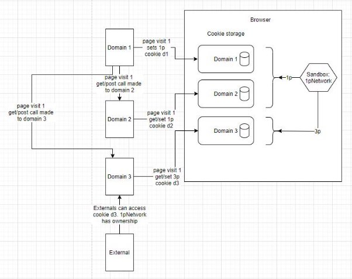
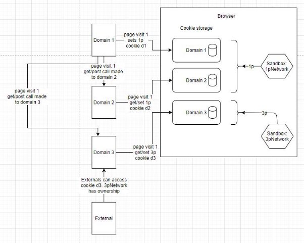
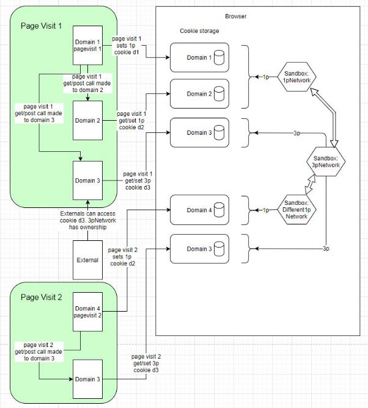
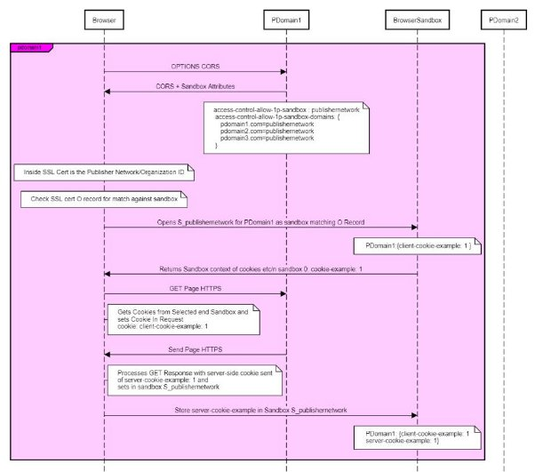
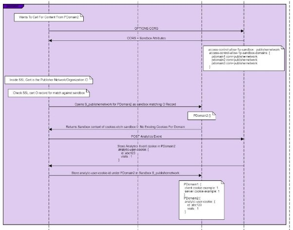
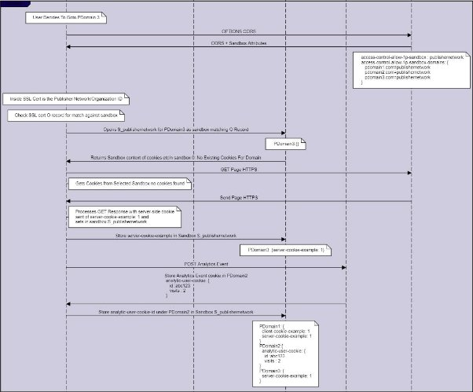

# SandPiper 


### Mark Lee : CTO,  mark@carbonrmp.com

### Alistair McLean : CDO,  alistair@carbonrmp.com


# D R A F T

## Abstract

The proposal describes a privacy preserving method to define a context that allows data storage amongst a network of certified partners. It employs additional headers in the HTTP protocol with security validation through SSL Certificates for secure validation.

## Introduction

Upcoming changes to browsers could potentially adversely affect the current operation of many websites and applications. Furthermore, controlof user and site interaction is steadily moving to the browsers requiring complex changes to existing web applications..

More scripts are being written on publishers’ domains in order to move logic to be first party which in turn can have a detrimental effect on page performance. If a solution around context based storage access worked in a controlled and transparent way then this wouldn’t be needed.

What is needed is transparency and user agency over what data is being used so that the user experience is enhanced without risking any intrusion of privacy and maintaining existing open web standards in a backwards compatible way with the least impact on existing applications.

We propose a standards based approach that returns control to the domain and user by building on an existing protocol. The approach allows a website operator to declare a sandbox that specifies how data can be accessed and shared. The proposal provides people with visibility over data movement and provides the opportunity to selectively override specific actions or membership.

This document describes the use cases that this proposalwill support, the principles of sandbox control and the technical detail of how this could be implemented.

## Glossary

Property Owner (vs Origin) etc - TODO

## Use Cases


TODO - link to PRAM use cases https://docs.google.com/document/d/17geRxY4Wko\_yzLkezlbGMIeD7s-DcaJOQfsCMMw8lxE/ edit#

### Attribution & Measurement

A classic use case for attribution is a user on a publisher site who is shown an ad for a pair of shoes and clicks on it and ends up buying the shoes. The marketers want to know which channels, campaigns and publishers are performing well. They therefore need to know that it was the same user that clicked on the ad ended up buying the shoes even if there was
a time and browsing gap between the click and the purchase.

The SandPiper model allows the publisher to create a sandbox with the marketer so that an id is shared and meta data such as the channeland any campaign can be added. This data can be accessed by the browser when a user visits either site. On a purchase the marketer’s site would look for attribution data in available Sandboxes.

The measurement use case is important for publishers with multiple domains. A method that supports the sharing of data across the group’s domains is required so that user sessions and other analytics information can be counted accurately. Using the SandPiper Sandbox a publisher would declare all their domains within the same sandbox - no message passing or link embellishment or cname mappings are needed, the browser simply uses the group’s shared sandbox store.

### Caching, CDN, and Load Balancing

File caching is used to improve the performance of sites but can also be used to store an ID. Browsers are locking this down to prevent tracking but this means that all resources need to be loaded for each domain (there is a domain level cache). The SandPiper sandbox control could be used to define a sandbox for file caching

Extend web session storage to allow declared 3p caching Continue to support 3p server sticky sessions for load balancing.

### Authentication

TODO : Logged in site X.    Allow any ‘entity’ to define an SSO network group with the defined sandbox

### Retargeting

TODO :

### Compliance

Currently user’s are asked for every domain in the same organisation to provide consent and many suffer from consent fatigue. Allowing the domain of the cmp (or indeed consensu.org) to be added as a 3p member of the sandbox would allow the CMP to read any previously captured consent and automatically apply that to any domain in the sandbox thus improving the user experience.

###Existing Enterprise Applications

Large enterprises and small enterprises can find themselves in the scenario of business critical applications no longer able to function in their intranet or extranet. These applications may not even be updatable or changeable as they could be software licensed or home built applications that are unable to be changed for legacy, legal, or lack of ability to do so. SandPiper would allow those applications to have a consistent state that effectively allows them to continue working by simply putting a load balancer in front to insert the headers and cert requirements.

### Restoring control back to the user

The sandbox can take user preferences into account by applying network or domain white or black list rules along with ttl overrides.

For example a user might not want a specific 3p within his sandbox or might want a longer ttl for a particular network’s logon details.

## Principles of SandPiper

At the heart of this proposal is a method of verifying the relationship between different participants that are accessing and storing data by expanding the use of SSL certificates and headers. This structure fits well into the existing HTTP specification and also allows for the existing trust in certificates with impartial SSLcertificate authorities. Such SSL providers already provided extended checks on legal entities when issuing Extended Validation Certificates.

## Pitfalls

TODO More Discussion

 * Complex configuration?
 * Might be ‘silently failing’ (expected vs actual ifmisconfigured) 
 * Requires browsers to implement the updated standard

## The Sandbox

The SandPiper Sandbox is a protected set of domains that the browser manages. It is an extension of the current (or soon to be) behaviour where a browser partitions data storage by domain, where the connected set is declared using new attributes on the CORS response headers.

The new attributes specify first party and third party membership of the sandbox using access-control-allow-1p-sandbox,  access-control-allow-1p-sandbox-domains, access-control-allow-3p-in-1p-domains, access-control-allow-3p-sandbox and access-control-allow-3p-in-3p-domains. These attributes require the browser to send preflight requests.

## SandPiper Technical Details

The proposal makes use of the SSL handshake and an additional (or reusing the Organisation) attribute in the certificate to provide authenticated sandbox definition. For example the certificate contains the value 1pNetwork in the Organisation attribute.

We use the CORS OPTIONS request here to illustrate how Sandpiper could operate but the mechanism could equally work in the SSL handshake. A new header Access-Control-Request-Headers is used to request sandbox access. For example:

```
OPTIONS /index.html HTTP/1.1
Host: domain2
Accept: text/html,application/xhtml+xml,application/xml;q=0.9,\*/\*;q=0.8 
Accept-Language: en-us,en;q=0.5
Accept-Encoding: gzip,deflate
Connection: keep-alive
Origin: https://domain1
Access-Control-Request-Method: GET, POST 
Access-Control-Request-Headers: Access-control-allow-1p-sandbox, Access-control-allow-1p-sandbox-domains, get-cookie, set-cookie
```

The server at domain2 extracts the Organisation Id from the certificate (1pNetwork) and determines that it has an invite to that Organisations’sandbox. It returns the following response:

```
HTTP/1.1 204 No Content
Date: Thu, 11 Feb 2021 17:15:39 GMT
Server: Apache/2.4.46 (Unix) 
Access-Control-Allow-Origin: https://domain1 
Access-Control-Allow-Methods: POST, GET, OPTIONS 
Access-Control-Allow-Headers: get-cookie, set-cookie
Access-control-allow-1p-sandbox : 1pNetwork 
Access-control-allow-1p-sandbox-domains : domain1=1pNetwork, domain2=1pNetwork 
Access-Control-Max-Age: 86400
Vary: Accept-Encoding, Origin
Keep-Alive: timeout=2, max=100
Connection: Keep-Alive
```


The browser then looks at the certificate on the response and determines that the Organisation Id is 1pNetwork, it then reads the headers and determines that it is allowed to issue GET and PUT requests and read and set cookies to domain2.

This is illustrated below: 

### 1p


### 3p

The approach can be extended to 3p networks to allow fine grained control. There are two ways to invite 3p networks to be part of a shared sandbox. They define who has control over the 3p network within the sandbox

#### 3p in the context of the 1p network

The 1p network invites the 3p network into the 1p network’s sandbox and in this case 3p data is stored within the 1p sandbox. Ie the 3p network runs in the context of the 1p network. The 1p network has control over the 3p domain storage. Domain3’s CORS response would be
```
access-control-allow-3p-sandbox-domains: {
	domain3.com=1pNetwork
}
```
The server at Domain3 extracts the Organisation Id from the certificate and determines that it has an invite to that Organisation’s sandbox. It returns the headers above and the browser similarly extracts the Organisation Id from the certificate, matches it with the sandbox name, and determines that GET/PUT cookie execution is allowed onto domain3 storage using the properties of the 1p sandbox.

In this case 1pNetwork context applies. For example if 1pNetwork has set a ttl of 7 days any ttl set by domain3 is ignored.



Non 1pNetwork sites may also have access to domain3 storage. For example domain 4 may also allow 3p access to domain3 in a different network :

```
access-control-allow-3p-sandbox-domains: {
	domain3.com=Different1pNetwork
}
```

In the same vein as above, on domain4 making a request to domain3 via CORS, the server at domain3 would extract the Organisation Id from the certificate and determine that it has an invite to domain 4 organisation’s sandbox called Different1pNetwork. It returns the headers above and the browser allows GET/PUT cookie execution onto domain3 storage.

#### The 3p network runs as a 3p domain on the 1p network - a global context

The second approach is where the 1p network allows the 3p network to run as a 3p domain on the 1p network. In this case there is a global3p sandbox that is accessible from the 1p network. The 3p has control over the 3p domain.

The configuration would be :
```
access-control-allow-1p-sandbox : 1pNetwork;maxCookieTtl
access-control-allow-1p-sandbox-domains: {
	domain1.com=1pNetwork
	domain2.com=1pNetwork
}

access-control-allow-3p-sandbox : 3pNetwork=1pNetwork
access-control-allow-3p-in-3p-sandbox-domains: {
	domain3.com=3pNetwork
}
```

The server at Domain3 extracts the Organisation Id (1pNetwork) from the certificate and determines that it has an invite to operate in a globalcontext called 3pNetwork. It returns the headers above and the browser allows GET/PUT cookie execution onto domain3 storage.

In this case the 3pNetwork context applies. For example if 1pNetwork has set a ttl of 7 days and 3pNetwork has set a ttl of 30 days then any cookies set will use the 3pNetwork values.



Non 1pNetwork sites may also have access to domain3 storage. For example domain 4 may also allow 3p access to domain3 in a different network :

```
access-control-allow-3p-sandbox-domains: {
	domain3.com=Different1pNetwork
}
```
or
```
access-control-allow-3p-sandbox : 3pNetwork=Different1pNetwork
access-control-allow-3p-in-3p-sandbox-domains: {
	domain3.com=3pNetwork
}
```



Here, when domain4 makes a request to domain3 via CORS, the server at domain3 would extract the Organisation Id (Different1pNetwork) from the certificate and determine that it has an invite to domain 4’s sandbox called 3pNetwork in a global context. It returns the headers above and the browser allows GET/PUT cookie execution onto domain3 storage using the global context of 3pNetwork respectively.

### matching
* can be used to allow groups of subdomains in the headers.

### Ttl

One of the attributes that can be easily controlled by a sandbox is ttl. For 3p invitees it is the sandbox owner, or the context that the 3p is running in, that has control over the cookie ttls. Ttls can be overridden by user preferences.

## Security and joining a sandbox

In order to join the sandbox the invitee has to be issued a certificate that lists the organisation. In a perfect world there would be a new attribute that defines the sandbox in the certificate

but we can currently do this by using the organisation attribute as a placeholder to the sandbox name.

As described above both the server and browser extract the sandbox name from the certificate and match it with the cors sandbox controlheaders.

## User Preferences

By exposing the sandbox names and domains to the browser a user preference section can

be displayed that allows the user to choose whether to allow or disallow their information to be passed to a sandbox or individual domains in that sandbox as well as being able to specify ttl overrides.

## Information Flow

The following sequence diagrams illustrate a 1p cors sandbox use case for analytics








